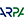
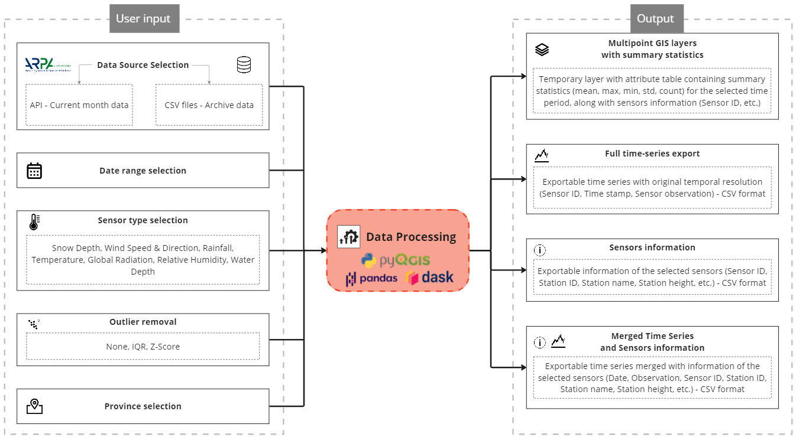

# ARPA Weather - QGIS Plugin

<br>
<p align="center">
   <br>
</p>
<br>

[](https://opensource.org/licenses/MIT)  

The ARPA Weather Sensors Plugin is a QGIS plugin designed to help users process time series data from weather sensors provided by the Regional Agency for Environmental Protection of Lombardy ([ARPA Lombardia](https://www.arpalombardia.it/Pages/Meteorologia/Osservazioni-e-Dati/Dati-in-tempo-reale.aspx)). With this plugin, you can easily import ARPA weather sensor data and process it using a variety of algorithms and methods available in QGIS.

> ⚠️ NOTE: Internet connection is required to request the data from the Open Data Lombardia portal.

## Installation

To use the ARPA Weather Sensors Plugin, you'll need to install a few libraries first. Specifically, you'll need to install [Sodapy](https://github.com/xmunoz/sodapy), [Pandas](https://pandas.pydata.org/docs/index.html), and [Dask](https://www.dask.org/).

<b>Sodapy</b><br>
Sodapy is a Python library that provides a simple interface for accessing data from the Socrata Open Data API. In the context of the ARPA Weather Sensors Plugin, Sodapy is used to retrieve data from the ARPA Lombardia weather sensors.

<b>pandas</b><br>
pandas is a powerful data analysis library for Python. It provides data structures for efficiently storing and manipulating large datasets, as well as tools for working with missing data, time series data, and more. In the context of the ARPA Weather Sensors Plugin, Pandas is used to process and analyze the weather sensor data.

<b>dask</b><br>
Dask is a flexible parallel computing library for Python. It allows you to process large datasets in parallel, using a variety of distributed computing strategies. In the context of the ARPA Weather Sensors Plugin, Dask is used to speed up the processing of large weather sensor CSV datasets.

### Windows

If you're using Windows, you can install these libraries using the `OSGeo4W Shell`. Here's how:

If you are using **QGIS >= 3.20**:

1. Open the `OSGeo4W Shell` as `Administrator`. If you already installed QGIS you can find `OSGeo4W Shell` in the Search bar. Type the following commands:
2. Check the environment:

```
o4w_env
```

3. Type the following command to upgrade pip (package installer):

```
>> python3 -m pip install --upgrade pip
```

4. Type the following command to install Sodapy:

```
>> python3 -m pip install sodapy -U --user
```

5. Type the following command to install pandas (recommended **>=1.5.3** version):

```
>> python3 -m pip install pandas -U --user
```

6. Type the following command to install Dask:

```
>> python3 -m pip install dask -U --user
```

If you are using **QGIS 3.18 or lower**:

1. Open the `OSGeo4W Shell` as `Administrator`. If you already installed QGIS you can find `OSGeo4W Shell` in the Search bar. Type the following commands:
2. Check the environment:

```
py3_env
```

3. Type the following command to upgrade pip (package installer):

```
>> python -m pip install --upgrade pip
```

4. Type the following command to install Sodapy:

```
>> python -m pip install sodapy
```

5. Type the following command to install pandas (recommended **>=1.5.3** version):

```
>> python -m pip install pandas
```

6. Type the following command to install Dask:

```
>> python -m pip install dask
```

### Linux and MacOS

If you're using Linux, you can install these libraries using the QGIS Python Console. Here's how:
Install pip (if you don't already have it) using the Terminal:

```
>> apt-get install python3-pip
```

1. Open the `QGIS Python Console`.
2. Type the following command to import pip:

```
>> import pip
```

3. Type the following command to install Sodapy:

```
>> pip.main(['install', 'sodapy'])
```

4. Type the following command to install pandas:

```
>> pip.main(['install', 'pandas'])
```

5. Type the following command to install Dask:

```
>> pip.main(['install', 'dask'])
```

---

> ⚠️ NOTE: It may be required to restart QGIS after installing all the packages.

---

Now you can open QGIS and do the following steps:

Go to `Plugins` → `Manage and Install plugins` → `Settings` → `Show also experimental plugins`

To use the **ARPA Weather** plugin, you can install it as a ZIP file. Here's how:

1. Download the plugin ZIP file from the GitHub repository from the green box in the top right corner `<>Code` → `Download ZIP`
2. Open QGIS and go to `Plugins` → `Manage and Install Plugins`...
3. In the `Manage and Install Plugins` dialog box, click on the `Install from ZIP` tab
4. Click the `...` button to browse to the location where you saved the plugin ZIP file, then click `Install Plugin`
5. QGIS will install the plugin and ask if you want to enable it. Click `Yes` to enable the plugin.

Be sure to have the ARPA Weather Plugin enabled in your installed plugins.

Once you've installed and enabled the plugin, you can use it to process ARPA Lombardia weather data.

---

## Plugin Structure

The following image summarizes the plugin functionalities:



## Usage

Once you have installed the ARPA Weather Sensors Plugin, you can use it to process ARPA Lombardia weather data.

Open `QGIS` and search for the plugin in the `Plugins` toolbar.

### Choosing the Data Source

With this plugin, you have the flexibility to choose whether to retrieve data from:

- **Socrata Open Data API** for the current month data
- **CSV files** for past month/years data (archived data)

You can easily select your preferred data source at the beginning of the process, and the plugin will automatically request data from the API or CSV files based on the selected date range. The CSV files are automatically downloaded by the plugin, and processed using the Dask Python library.

**Notes**

- This plugin does not require an API token, but it might be necessary in future to access all datasets on Open Data Lombardia on Socrata API without any limitations (the use of the token has been left intentionally optional for this reason)
- Only dates within the same year can be processed at the same time, as the size of the CSV files is around **2GB** and processing multiple years together might be computationally intensive for common hardware
- **When QGIS is closed, all downloaded CSV files are deleted** (to avoid filling your PC memory). These files are stored in the `tmp` folder inside the plugin directory, and a link to the folder is provided inside the plugin
- If the CSV file for the selected year is already available inside the `tmp` folder, the corresponding CSV folder won't be downloaded
- Sensor information (e.g. sensors id, stations id, location etc.) is obtained using the Socrata API.

### Selecting the Time Range and Sensor Type

Once you have selected the data source (API or CSV) you can choose:

- time range for which you want to retrieve data (dates in the calendar are automatically limited to the correct time range based on the selected parameters)
- province to filter the data by location (if no provinces are selected all are selected by default)
- weather sensor type you are interested in (e.g. temperature, precipitation etc.). The following table describes the names of the available sensors:

|     Sensor Type     |     Sensor name     |      Unit       |
| :-----------------: | :-----------------: | :-------------: |
|    `Snow Depth`     |    Altezza Neve     |       cm        |
|  `Wind Direction`   |   Direzione Vento   |  Degree North   |
|    `Water Level`    | Livello Idrometrico |       cm        |
|     `Rainfall`      |   Precipitazione    |       mm        |
| `Global Radiation`  | Radiazione Globale  | W/m<sup>2</sup> |
|    `Temperature`    |     Temperatura     |  <sup>°</sup>C  |
| `Relative Humidity` |  Umidità Relativa   |        %        |
|    `Wind Speed`     |   Velocità Vento    |       m/s       |

> Note: Legend: -9999 = missing data 888, 8888 = variable wind direction 777, 7777 = calm wind condition (for wind direction only).
> For `idoperatore` column: Average value 3: maximum value 4: Cumulated value (for rain)
> You can find more detailed information and metadata relative to the variables on [Open Data Lombardia website - Dati sensori meteo](https://www.dati.lombardia.it/Ambiente/Dati-sensori-meteo/i95f-5avh).

### Removing Outliers

You can choose to remove outliers from the data using one of three functions:

- None (if you don't want to remove any data)
- Interquantile Range (IQR)
- Z-Score (default threshold set equal to 3)

Selecting one of these functions will help you to remove anomalous data points that may be affecting your analysis.

### Exporting

When processing weather sensor data using this plugin, you can obtain a range of relevant summary statistics and multipoint layers for different sensors. These include:

- Mean, maximum, minimum, standard deviation, and count: for all variables, except for Wind Direction.
- Mode and count, for Wind Direction, which is expressed in Degree North.

These statistics are calculated based on the selected time range and sensor type.

**Map layer attributes**

|   Column Name    |                                   Information description                                    |
| :--------------: | :------------------------------------------------------------------------------------------: |
|   `idsensore`    |                                       ID of the sensor                                       |
|   `tipologia`    |                              Type of sensor (e.g. temperature)                               |
| `unit_dimisura`  |                                    Measure Unit (e.g. °C)                                    |
|   `idstazione`   |              Station ID (multiple sensors can be available at the same station)              |
|  `nomestazione`  |                                     Name of the Station                                      |
|     `quota`      |                   Orthometric height of the station (above sea level) (m)                    |
|   `datastart`    |                        Start date of the time-series for that sensor                         |
|    `storico`     | Indicates whether the sensor is historical or still working (S=historical, N=not historical) |
|      `lng`       |                                          Longitude                                           |
|      `lat`       |                                           Latitude                                           |
| `media` / `moda` |           Average of the variable (or mode is used if Wind Direction is requested)           |
|      `max`       |                   Max of the variable (not available with wind direction)                    |
|      `min`       |                   Min of the variable (not available with wind direction)                    |
|      `std`       |            Standard deviation of the variable (not available with wind direction)            |
|   `conteggio`    |                    Number of observations used for statistics calculation                    |

The plugin generates a temporary layer named with sensor type and the time range used in the processing step, for example `Temperatura (2023-03-01 00:00:00 / 2023-03-31 05:50:00)`.

The plugin allows to optionally export multiple additional files. The following is the list of exportable CSV files:

- Attribute table containing sensors information
- Time-series containing observations for the selected sensors in the time-range. The exported file contains dates and sensors IDs already ordered by increasing sensor number and date
- Sensors information (e.g. sensor id, station id, location etc.) inside the selected provinces. Sensors that are not functional anymore (Storico=S) are exported as well for completeness (they might be useful for other analyses)
- Time-series containing dates and observations for the selected sensors in the time-range, merged with sensors information.

## Project LCZ-ODC

The plugin is being developed within the [LCZ-ODC project](https://www.asi.it/2023/05/i4dp_science-primi-traguardi-del-progetto-lcz-odc/) (agreement n. 2022-30-HH.0) funded by the Italian Space Agency (ASI) and Politecnico di Milano, which aims to identify Local Climate Zones within the Metropolitan City of Milan.

Released under MIT license.

### ARPA Weather Plugin Author

- <b>_Emanuele Capizzi_</b> (emanuele.capizzi@polimi.it)

### Contacts - LCZ-ODC Project

Politecnico di Milano DICA Team:

- <b>_Maria Antonia Brovelli_</b> (maria.brovelli@polimi.it)
- <b>_Barbara Betti_</b> (barbara.betti@polimi.it)
- <b>_Giovanna Venuti_</b> (giovanna.venuti@polimi.it)
- <b>_Daniele Oxoli_</b> (daniele.oxoli@polimi.it)
- <b>_Alberto Vavassori_</b> (alberto.vavassori@polimi.it)
- <b>_Jesus Rodrigo Cedeno Jimenez_</b> (jesusrodrigo.cedeno@polimi.it)

Italian Space Agency (ASI) Team:

- <b>_Deodato Tapete_</b> (deodato.tapete@asi.it)
- <b>_Mario Siciliani de Cumis_</b> (mario.sicilianidecumis@asi.it)
- <b>_Patrizia Sacco_</b> (patrizia.sacco@asi.it)
